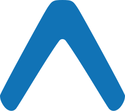

<h1 align="center">
    
</h1>

<h4 align="center">
  OmniStack 10.0
</h4>

  

  

  

  

 

  

## 🌍 Ecosystem

Below the Stack (set of tools), used to build this project. High productivity and performance:

|                      Environment                            |                         Description                     |
|:-----------------------------------------------------------:|:-------------------------------------------------------:|
|| As an asynchronous event-driven JavaScript runtime |
|| A JavaScript library for building user interfaces |
|| To create native apps for Android and iOS |
|| Enables you to build universal native apps using only JavaScript |

## 💻 Projeto

DevRadar é um projeto que visa conectar desenvolvedores próximos a você e que trabalham com as mesmas tecnologias.

## 🤝 Contributing

- Fork the repository;
- Create a branch for your edits: `git checkout -b new-feature`;
- Commit changes to your own branch: `git commit -m 'feat: New feature'`;
- Push the change back to your fork: `git push origin new-feature`;

Submit a Pull request. We will review and merge your change.

## :memo: License

This project is licensed under the MIT license. See the [LICENSE](LICENSE) file for details.

