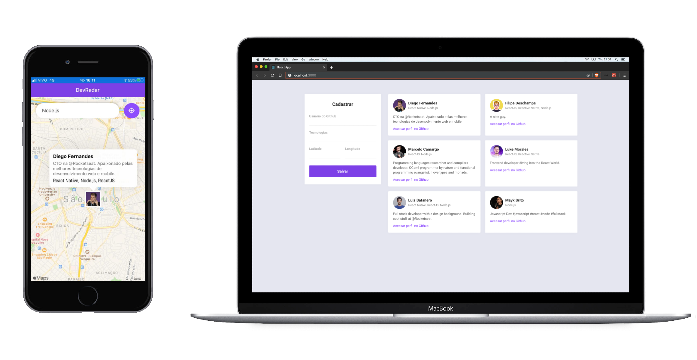

<h1 align="center">
    
</h1>

<h4 align="center">
  OmniStack 10.0
</h4>

  

  

  

 

  

## 🌍 Ecosystem

Below the Stack (set of tools) used to build this project. High productivity and performance:

|                      Environment                            |                         Description                     |
|:-----------------------------------------------------------:|:-------------------------------------------------------:|
|| As an asynchronous event-driven JavaScript runtime |
|| A JavaScript library for building user interfaces |
|| To create native apps for Android and iOS |
|| Enables you to build universal native apps using only JavaScript |

## 💻 Getting started

You can get this application running on your local environment in few minutes with these steps:

**Backend**

1. Clone the repository;
2. Move into the project folder: `cd backend`;
3. Replace _mongodb uri_ in [index](backend/src/index.js) file.
4. Run `yarn` to install all the dependencies;
5. Run `yarn dev`;

**Webpage**

6. Move into the project folder: `cd web`;
7. Run `yarn` to install all the dependencies;
8. Run `yarn start`;

**Mobile app**

6. Move into the project folder: `cd mobile`;
7. Replace _baseURL_` in [api](mobile/src/services/api.js) file.
8. Replace _socket uri_ in [socket](mobile/src/services/socket.js) file.
9. Run `yarn` to install all the dependencies;
10. Run `yarn start`;
11. Download Expo App for <a href="https://play.google.com/store/apps/details?id=host.exp.exponent&referrer=www">Android</a> or <a href="https://apps.apple.com/app/apple-store/id982107779">iOS</a>;
12. Scan the QR code;

## 🤝 Contributing

- Fork the repository;
- Create a branch for your edits: `git checkout -b new-feature`;
- Commit changes to your own branch: `git commit -m 'feat: New feature'`;
- Push the change back to your fork: `git push origin new-feature`;

Submit a Pull request. We will review and merge your change.

## :memo: License

This project is licensed under the MIT license. See the [LICENSE](LICENSE) file for details.

